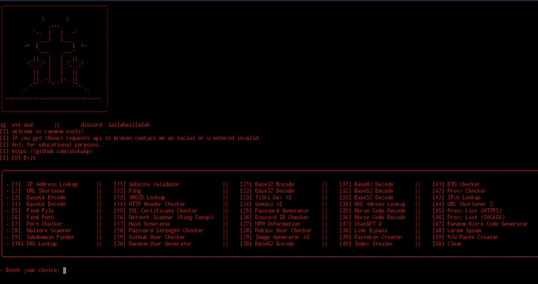

# **atorandomtools**
- Thats useful multiple tool for easy jobs, made with <3 by wazely
- 50x random tools powered by APIs

## **❗️**
- Sometimes API services can be broken or slow.
- Only for educational purposes.
- If u find any bug send me on socials.
- I didnt try every tool can be missing codes.

## **Linux Tutorial**
```
— pkg update && pkg upgrade -y
— pkg install python git -y
— git clone https://github.com/atohanpy/atorandomtools
— cd atorandomtools
— pip install -r requirements.txt
— python atorandomtools.py
```

## **Preview**

